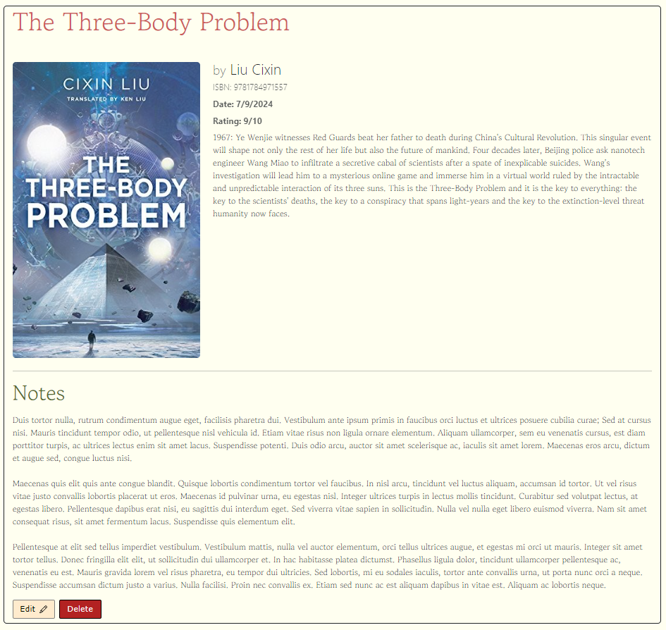

# Book Notes
### A web application for registering notes about books you've read!
### Technologies used:
- **[Bootstrap](https://getbootstrap.com/)** to style and design the site
- **[Node.js](https://nodejs.org/)** and **[Express](https://www.npmjs.com/package/express)** to set the routes and the application logic at the back-end
- **[EJS](https://ejs.co/)** to communicate with the front-end
- The **[pg](https://www.npmjs.com/package/pg)** framework to connect to the PostgreSQL database and execute queries

### Skills practiced:
- Front-end design and responsiveness
- CRUD implementation
- Complete full-stack web application flow
- Database connection and queries

### Homepage:


### View book and notes screen:


### Add new book screen:


### Edit book screen:


### If you want to run this application, you need to install [Node.js](https://nodejs.org/) and [PostgreSQL](https://www.postgresql.org/download/).
- After cloning this repository, run ```npm i``` inside the directory to install dependencies.
- Then set the *your* **user** and **password** parameters for the database connection in the **index.js** file. The default is **"postgres"** and **"123456"**, respectively.
- Open **pgAdmin** and run both queries at the **query.sql** file to create the database and it's table.
- Finally, run ```node index.js``` in the main directory and open [localhost:3000](http://localhost:3000/).